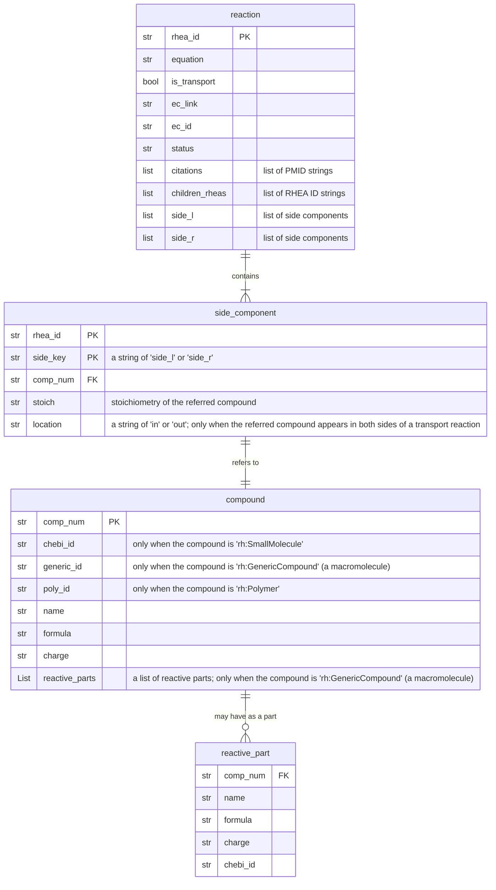

## Overview

This API pulls reaction data from https://www.rhea-db.org/. The `rhea.rdf` file with this information is structured in a flat format chunked into `<rdf:description>` tags. The parser takes these chunks one by one to walk through the rdf file. 

An example of output RHEA objects:

```python
{
    "rhea_id": "RHEA:10192",
    "equation": "ATP + H2O + sulfate(out) = ADP + H(+) + phosphate + sulfate(in)",
    "is_transport": true,
    "ec_link": "http://purl.uniprot.org/enzyme/7.3.2.3",
    "ec_id": "7.3.2.3",
    "status": "Approved",
    "citations": [
        "PMID:7608089"
    ],
    "children_rheas": [
        "RHEA:10193",
        "RHEA:10194",
        "RHEA:10195"
    ],
    "side_l": [
        {
            "comp_num": "6372",
            "chebi_id": "CHEBI:30616",
            "name": "ATP",
            "formula": "C10H12N5O13P3",
            "charge": "-4",
            "stoich": "1"
        },
        {
            "comp_num": "1283",
            "chebi_id": "CHEBI:15377",
            "name": "H2O",
            "formula": "H2O",
            "charge": "0",
            "stoich": "1"
        },
        {
            "comp_num": "5441",
            "chebi_id": "CHEBI:16189",
            "name": "sulfate",
            "formula": "O4S",
            "charge": "-2",
            "stoich": "1",
            "location": "out"
        }
    ],
    "side_r": [
        {
            "comp_num": "2710",
            "chebi_id": "CHEBI:456216",
            "name": "ADP",
            "formula": "C10H12N5O10P2",
            "charge": "-3",
            "stoich": "1"
        },
        {
            "comp_num": "3249",
            "chebi_id": "CHEBI:15378",
            "name": "H(+)",
            "formula": "H",
            "charge": "1",
            "stoich": "1"
        },
        {
            "comp_num": "5518",
            "chebi_id": "CHEBI:43474",
            "name": "phosphate",
            "formula": "HO4P",
            "charge": "-2",
            "stoich": "1"
        },
        {
            "comp_num": "5441",
            "chebi_id": "CHEBI:16189",
            "name": "sulfate",
            "formula": "O4S",
            "charge": "-2",
            "stoich": "1",
            "location": "in"
        }
    ]
}
```

Important notes: 

- Rhea id's have the CURIE `"RHEA:##"` with variable number of numbers as the unique ID. .  
- Every reaction has 4 rhea id's associated with it (e.g. `RHEA:10000`, `RHEA:10001`, `RHEA:10002`, `RHEA:10003`). Each are the same except have different directionality of the reaction associated. Each `rhea_entry` yielded by `parser.py` groups all 4 rhea's into one dictionary object. The primary id (first of the set of 4) is associated with the key `"rhea_id"`. The other 3 rhea id's can be accessed with the key `"children_rheas"`.
- Some rhea IDs are obsolete but still included in the output however these have a value of `"Obsolete"` associated with the `"status"` key for the rhea entry. 
- Reaction participant information can be accessed with the two keys `"side_l"` and `"side_r"`. 
- Not all participant compounds have a `chebi_id` but most do. Some instead have a `poly_id` (for polymer entries) or a `generic_id` for generic compounds (example of a generic compound: `[protein]-dithiol`). ChEBI id's have the CURIE `"CHEBI:##"`
- Citation information can be accessed for all rhea's that have it with the key `"citations"`. Citations are all pubmed citations with the the CURIE `"PMID:"`

## RHEA Object Construction

Although `rhea.rdf` is a flat file, the entity relationships of our interest can be described as in the 4 tables below.



Each table corresponds to a `DataFactory` class in our `parser.py`.

To learn all the entity relationships in the `rhea.rdf`, please read [Rhea RDF documentation (version: November 2020)](https://ftp.expasy.org/databases/rhea/rdf/rhea_rdf_documentation.pdf).